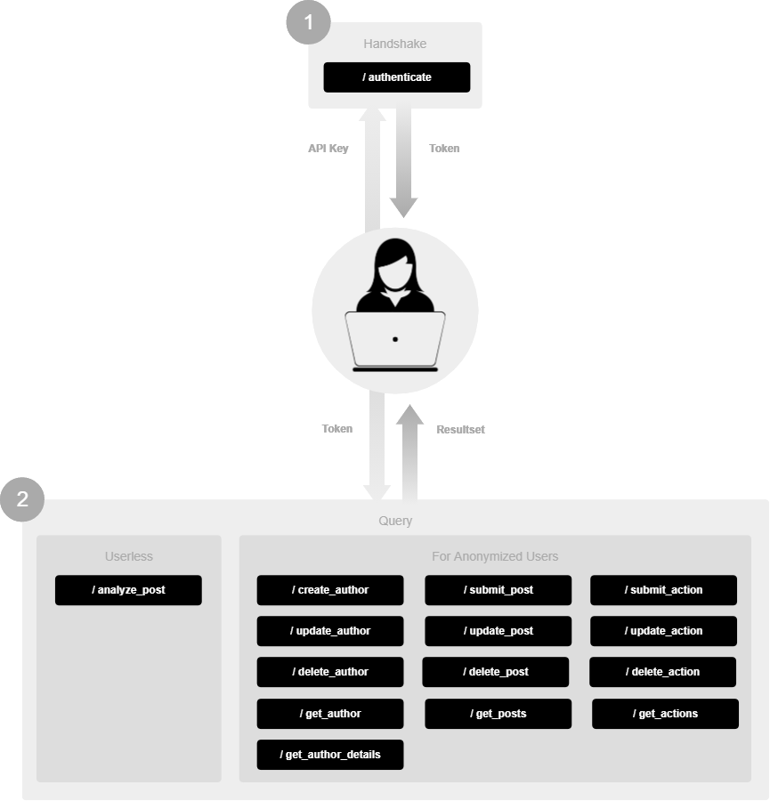

# Overview

# Changelog
This is a non-backwards-compatible release of the API.

# Endpoints

## Authentication
- [/authenticate](1-0/authenticate.md)

## Authors
- [/create_author](1-0/create_author.md)
- [/update_author](1-0/update_author.md)
- [/delete_author](1-0/delete_author.md)
- [/get_authors](1-0/get_authors.md)
- [/get_author_details](1-0/get_author_details.md)

## Posts
- [/submit_post](1-0/submit_post.md)
- [/update_post](1-0/update_post.md)
- [/delete_post](1-0/delete_post.md)
- [/get_posts](1-0/get_posts.md)

## Actions
- [/submit_action](1-0/submit_action.md)
- [/update_action](1-0/update_action.md)
- [/delete_action](1-0/delete_action.md)
- [/get_actions](1-0/get_actions.md)

## Analyze (no author required)
- [/analyze_post](1-0/analyze_post.md)
