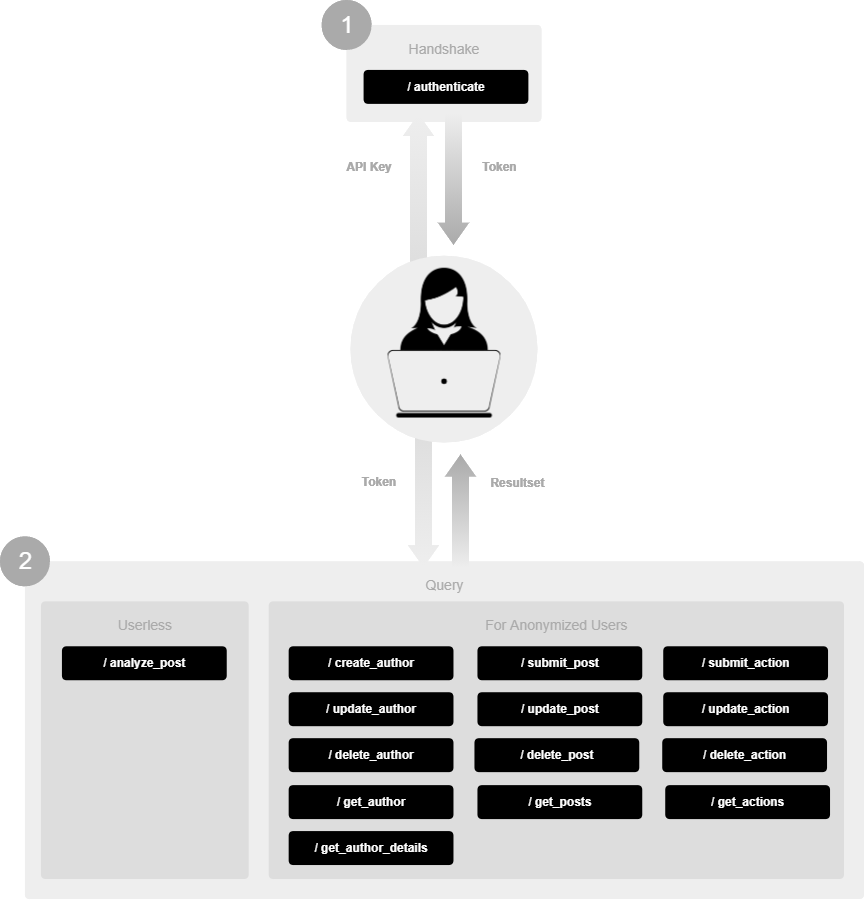

# Overview

# Changelog
This is a non-backwards-compatible release of the API.

# Endpoints

## Authentication
- [/authenticate](authenticate.md)

## Authors
- [/create_author](create_author.md)
- [/update_author](update_author.md)
- [/delete_author](delete_author.md)
- [/get_authors](get_authors.md)
- [/get_author_details](get_author_details.md)

## Posts
- [/submit_post](submit_post.md)
- [/update_post](update_post.md)
- [/delete_post](delete_post.md)
- [/get_posts](get_posts.md)

## Actions
- [/submit_action](submit_action.md)
- [/update_action](update_action.md)
- [/delete_action](delete_action.md)
- [/get_actions](get_actions.md)

## Analyze (no author required)
- [/analyze_post](analyze_post.md)
