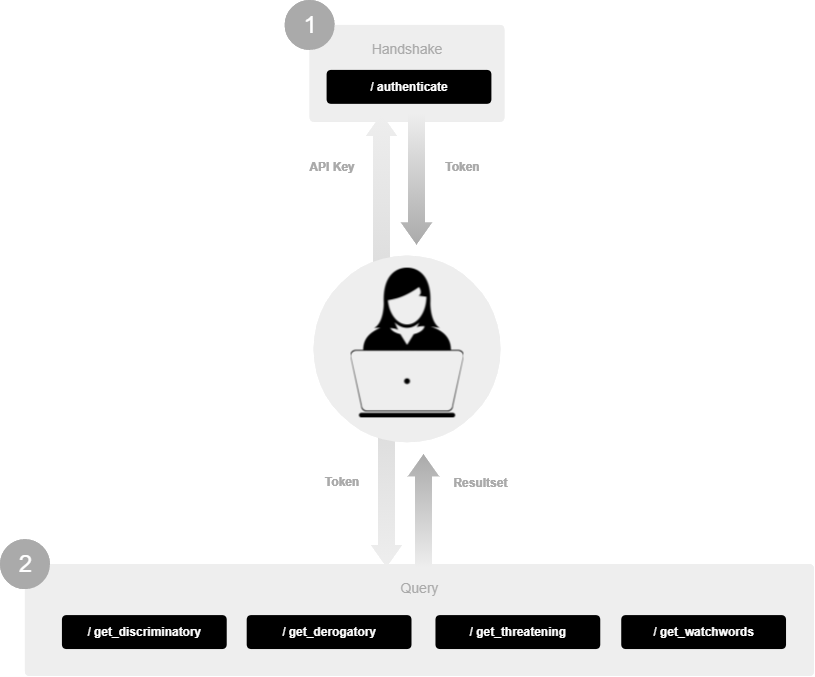

# Overview

# Changelog
This is a non-backwards-compatible release of the API.

# Endpoints

## Authentication
- [/authenticate](authenticate.md)

## Lexicons
- [/create_author](get_discriminatory.md)
- [/update_author](get_derogatory.md)
- [/delete_author](get_threatening.md)
- [/get_authors](get_watchwords.md)
