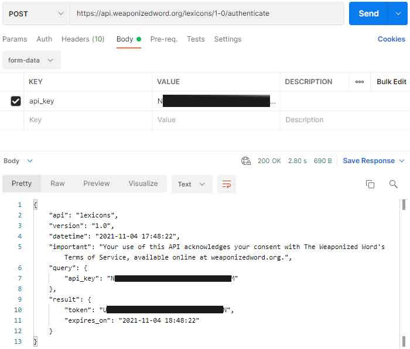
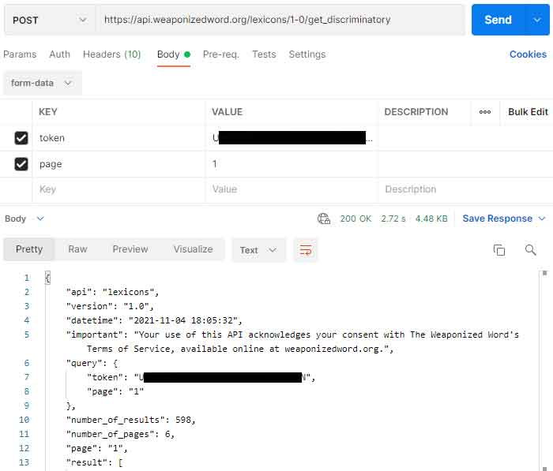

# Requirements
Before beginning, there are two things you'll need before attempting to access the API:

- An API key. You'll need to be logged in to provision this, and the API key will only generate results if you've been approved for a plan.
- Some software for testing API connections. We recommend [Postman](https://getpostman.com), because (1) it's free and (2) once you've successfully connected it can generate some preliminary code for you to start your own custom integration.

# The Basics
Your private API key identifies you as a unique user of the API. Please keep it secret. Don't share it, don't email it, and don't embed it in browser-viewable code. If you ever believe your API key has been compromised, you can assign yourself a new one, but when you do this you'll need to update any integration code you've written. If you expose your API key in a public code repo, your API access will be terminated.

Use of the API is monitored and volume-limited. This means that if you query the API too many times, or too often, the API will shut you down, and if you continue to hammer the server with superfluous requests, this will be considered a DDoS attack and your account will be disabled.

Usually when there are too many requests against the API, it's because you're trying to query the API in user real-time -- in other words, a user on your platform does something and then you immediately query the API and make the user wait on results. This is an inherently flawed architecture. A safer architecture is to download our data asynchronously and store it locally, which gives you better real-time performance and doesn't burden you (or us) with redundant data retrieval.

# How It Works
Querying the API is a two-step process.

The first step is an authentication handshake in which you send your API key and the API will return a session token (a random string of characters) that you can use for the next hour or so in lieu of continually sending your API token. Minimizing the transit of your API token across the Internet reduces the chances of third-party interception.

The second step is the actual query itself, in which you connect to one of the API's endpoints, send your session token and some input parameters, and receive a resultset. For those new to APIs, endpoints can be thought of as specific URLs which returns results. All endpoints have the same URL structure. For example:

```
https://api.weaponizedword.org/1-0/authenticate
```

You'll notice the URL contains both a version number ("1-0") and the endpoint ("authenticate"). For a list of all endpoints, consult the [full API documentation](/API-Documentation/README.md), but for the purposes of this tutorial, we'll be using the /authenticate and /get_discriminatory endpoints.

# Authenticating
Configure Postman as follows. You'll want to substitute your own API key for the one shown.



The returned token is your session token and is good for an hour, which should be more than enough time to query whatever data you need. If your session token does expire, you can simply reauthenticate to obtain a new one.

Note that any results returned from the API may include warnings and/or errors. Warnings won't impede results, but errors will. A complete list of warning and error codes is [available online](https://weaponizedword.org/api_error_codes).

When writing integration code, it's imperative that you be responsive to errors and warnings, since continuing to generate error states can result in your account being disabled. In particular, be alert to warnings that you are approaching your query limit, or that the version of the API you're using is approaching retirement.

# The Query
Now that you have a session token, it's time to query some actual data from the API. Configure Postman as follows. Note that the token below is the session token that was returned to you during authentication.



The structure of the resultset will be consistent for the life of a given API version, but new API versions will not necessarily reflect the parameters depicted here.

# The Importance of IDs
The API uses IDs for uniqueness. These IDs are valuable for determining whether you've already consumed a piece of content through the API, and thus can help ensure that you're only downloading the freshest data.

# Next Steps
Now that you've successfully connected to the API, you're ready to begin your own integration using code generated by Postman or your own custom code.

Please keep an eye on our website and/or the output of your queries for advance notice of new API versions.
